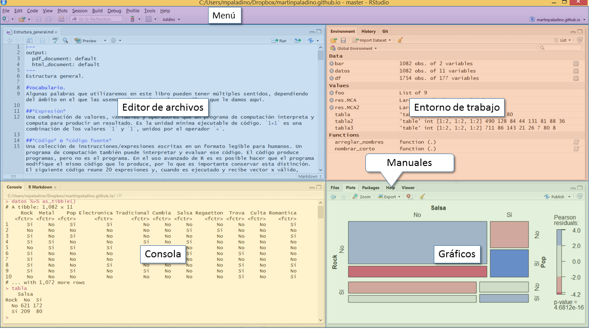

```{r setup, include=FALSE}
knitr::opts_chunk$set(echo = TRUE)
```

#¿Qué es R? 

Este documento lo guiará en los primeros para necesarios para convertirse en usuario de R. R es una plataforma de software para análisis de datos, con especial énfasis en el análisis estadístico. Como es una plataforma la interacción entre R y el usuario son diferentes a la que llevamos a cabo cuando utilizamos una aplicación. R no es una aplicación o app. Una aplicación hace relativamente pocas cosas y hay caminos bien definidos para hacerlas. En general una aplicación tiene una sola forma de hacer algo, en R hay muchas formas de hacer lo mismo y, si ninguna le convence, puede crear la suya. Por eso decimos que R es una plataforma, porque es un *programa para hacer programas*. No se asuste, es más fácil de lo que parece, aunque más difícil que manejar una app. 

Quizás valga la pena aclarar de qué hablamos cuando hablamos de R, ya que significa dos cosas:

- el *lenguaje de programación R*. 

Como tal es una **especificación sintáctica** para pasar comandos a una computadora. Como lenguaje no existe sino idealmente, como una especificación descripta en un libro. Del mismo modo el castellano existe idealmente, hasta que lo hablamos o escribimos y alguien nos entiende. Aprender a usar R es aprender a "hablar" este lenguaje, conocer sus convenciones y aplicarlas de manera tan rigurosa como creativa.  
Puntualmente R es un DSL, Domain Specific Language, o Leguaje de Dominio Específico. A diferencia de los lenguajes de programación generales (como C, C++, Java o Scheme)^[Scheme y Lisp tuvieron gran influencia en S, el lenguaje en el que se basa R.] R fue diseñado desde sus orígenes para el análisis de datos. Esto le resta algo de flexibilidad, pero lo dota de herramientas específicas para el análisis de datos que nos facilitan muchísimo el trabajo. Cuando decimos que es "menos flexible" lo decimos con respecto a un lenguaje general, en comparación de otros lenguajes de análisis de datos como Stata o SPSS o el mismo SAS, R es algunos ordenes de magnitud más flexible.  

- el *intérprete* 

El intérprete de R es el software que ejecuta el código escrito en lenguaje R. Se trata de un *programa* al que pasamos instrucciones escritas en lenguaje R y que es capaz de evaluarlas, procesarlas y regresarnos un resultado. En este sentido es posible --y necesario-- "instalar" R en nuestra computadora. El intérprete estándar de R se llama... R y es el que utilizaremos, nosotros y millones de personas que tienen la necesidad de analizar datos con un plataforma flexible, poderosa y gratuita. 

El desarrollo del intérprete R está a cargo de la [R Foundation](https://www.r-project.org/foundation/), una organización sin fines de lucro que se encarga de organizar el trabajo de miles de voluntarios que crean y mejoran permanentemente a este programa. Voluntarios no significa aficionados: algunos de los programadores más talentosos del mundo y líderes en sus campos de investigación donan su tiempo a la R Foundation y producen un software de gran calidad. El intérprete de R se distribuye bajo la licencia GNU/GPL la más estricta de las licencias de código abierto. Por eso R es software libre y nunca dejará de serlo. R es libre en dos sentidos: es completamente gratuito y el código fuente está disponible para cualquier persona lo revise, valide o modifique. Si le preocupa la validez de los resultados de un software creado por voluntarios tenga en cuenta que, al ser de fuente abierta, el código de R está auditado por miles de personas. 
Como si esto fuera poco R es multiplataforma. Tiene versiones estables y fáciles de instalar para los principales sistemas operativos: Windows, macOS y Linux. 

El intérprete de R es fundamental, pero usarlo directamente no es una experiencia amigable: solamente nos ofrece un *prompt* en el que introducimos instrucciones con el teclado. Por suerte existe [Rstudio](https://www.rstudio.com/), un entorno de trabajo para R que organiza el flujo de trabajo y facilita la interacción con el intérprete, al punto que jamás lo veremos personalmente. Rstudio es el mensajero que se encarga de facilitar la comunicación con R y también es software libre, gratuito y multiplataforma. 

# Instalación de R y Rstudio. 

Por sí mismos R es muy difícil y Rstudio no hace nada. Pero juntos... hacen maravillas. En este apartado le daremos las instrucciones para instalar R y Rstudio en Windows, aunque no es complicado hacerlo para macOS.

1. Descargue la última versión de R para Windows. A la fecha la última versión es la 3.3.3. 

- Para Windows descárguela en (https://cran.r-project.org/bin/windows/base/). Busque el enlace de descarga en esa página. 
    - El nombre del archivo instalador es R-3.3.3-win.exe. Recuerde la ubicación de este archivo. 
2. Ejecute el archivo `R-3.3.3-win.exe`. Quizás Windows le de una advertencia de que el software que quiere instalar no es seguro. Ignórela con toda confianza: si descargó R del repositorio oficial no tiene nada que temer. 
    - Si instala R en la ubicación por defecto no habrá problemas, si cambia el directorio de instalación recuerde la ubicación: Rstudio la solicitará. 

3. Descargue la última versión estable de Rstudio Desktop.  A la fecha la última versión es la 1.0.143. 

- La encontrará en (https://www.rstudio.com/products/rstudio/download/).
    - El archivo instalador se llama RStudio-1.0.143.exe. 

4. Ejecute el archivo `RStudio-1.0.143.exe`

- Si instaló R en la ubicación por defecto Rstudio lo notará y el proceso de instalación estará listo. 

5. Abra la aplicación Rstudio desde el menú de inicio. No es necesario abrir R, Rstudio lo hace por nosotros.  

# Interface de Rstudio. 

¡Bienvenido! Ya tiene R funcionando en su computadora y una interface que le facilitará el trabajo. Dado que interactuamos con R a través de Rstudio vale la pena ver qué es lo que hay. Si nunca usó un Entorno Integrado de Desarrollo quizás le llame la atención lo que ve y no sepa por dónde empezar. Veamos la interface de Rstudio. 



## La consola. 

La consola es el lugar en el que interactuamos con R. Es un punto de entrada de instrucciones y esas instrucciones se pasan al programa escribiéndolas en el teclado y presionando `Enter` para que se ejecuten. Si quiere pasar su primera instrucción a R pídale que haga una suma introduciendo `2+2` al lado del símbolo `>` y luego presione `Enter`. Debajo debería ver el resultado. 
En su forma más simple la consola funciona como una calculadora y acepta los operadores aritméticos convencionales: `+`,`-`,`*`,`/`,`^`, este último para elevar un número a una potencia. 

Las instrucciones que pasamos a la consola **siempre** nos regresan un resultado, si hicimos algo mal ese resultado será un* mensaje de error*. Haga la prueba intentando sumar dos letras introduciento `"a"+"b"` . 

Para corregir un error o repetir una instrucción puede navegar el historial de instrucciones usando las flechas del teclado: `Arriba` para regresar a la línea anterior, `Abajo` para una línea posterior. Si quiere ver los resultados que quedaron más arriba puede `Página Arriba` y `Página abajo` para regresar. Si quiere eliminar lo que está escribiendo y regresar a un punto de entrada limpio pulse `Escape`. 

>Hágase amigo de su teclado. Analizando datos con R usará muchísimo el teclado y casi nada el mouse. De hecho usaremos muchos símbolos que posiblemente no haya usado antes. Al principio le llevará un poco de tiempo ubicarlos en el teclado, con la práctica los encontrará rápidamente y notará que trabajo mucho más rápido si no saca las manos del teclado y la vista de la pantalla.  
Ni las instrucciones que le damos a R en la consola ni los resultados se guardan, así que no le recomiendo hacer el análisis de datos dando instrucciones en la consola. Mejor organícelas en un archivo de código usando el editor integrado de Rstudio. 


2. Editor de Archivos. 

Rstudio tiene un editor de archivos de texto, en apariencia similar a notepad o alguna aplicación por el estilo, sólo que muchísimo más poderoso y específicamente diseñado para trabajar con la sintaxis de R. Para trabajar con el editor es necesario crear un archivo, y puede hacerlo desde el Menú de Rstudio. Vaya a File->New File->R Script para crear un archivo de código R o pulse simultáneamente `Ctrl-Shift-N`. Así habrá creado un archivo, que no tiene título todavía. Para guardarlo vaya al Menú File->Save o directamente presiones `Ctrl-s`. La primera vez que guarde un archivo nuevo Rstudio le pedirá que especifique una ubicación y un nombre, como cualquier otro programa. La extensión de los archivos de código R es `.r` y RStudio la asignará de manera automática. 

>Piense en el nombre que le va a dar a los archivos, su yo del futuro se lo agradecerá. Si está haciendo un ejercicio y al archivo lo llama `ejercicio` en el momento recordará de qué se trata. En unos meses *no*. 

No es necesario copiar y pegar las instrucciones en la consola para ejecutarlas. Desde el editor de texto ubíquese en la línea que quiere ejecutar y presiones `Ctrl-Enter` para que se ejecute. En el editor `Enter` no ejecuta el código, crea una nueva línea. Si quiere ejecutar una secuencia de instrucciones márquelas con el mouse y luego presione `Ctrl-Enter`.  


3. Entorno de trabajo. 

A medida que vaya desarrollando su análisis con R irá creando objetos en los que se almacenan las bases de datos y los resultados del análisis. Esos objetos no se guardan en el disco rígido, existen solamente en la memoria y, cuando les hemos asignado un nombre, aparecen en el apartado `Entorno de trabajo` de Rstudio. 
Un entorno de trabajo desprolijo es un problema tarde o temprano. En su escritorio no guarda todos los expedientes, artículos o cualquier material con el que haya trabajado a lo largo de su vida. En R tampoco debería hacerlo. Para facilitarnos la prolijidad en el trabajo R y Rstudio se organizan por proyectos. Es una forma simple e intuitiva de tener juntos todos los recursos que necesitamos para un análisis (bases de datos, archivos de código, manuales de referencia, informes) y solamente esos. Para crear un proyecto nuevo vaya al Menú File-> New Project y luego selecciones la carpeta en la que guardará el proyecto y el nombre que le dará. Al crear y luego guardar un proyecto podrá dejar de trabajar y cerrar Rstudio sabiendo que puede volver a abrirlo y encontrar todo exactamente como lo dejó. Si guarda el proyecto en DropBox puede seguir trabajando en otra computadora. 

>Cuando analizamos datos nos interesa el resultado del análisis y no tanto el proceso que nos lleva a ese resultado. No ajusto un modelo lineal para conservar la forma en que lo hice, lo hago para conocer los coeficientes, errores y estadísticos de diagnóstico. Sin embargo considere lo siguiente: es trivialmente fácil y lleva fracciones de segundo producir nuevamente los resultados a partir de las instrucciones, pero es prácticamente imposible reproducir las instrucciones a partir de los resultados. Por eso le recomiendo enfáticamente *no* guardar los resultados y guardar *siempre* en un archivo el código que los produce. Con el código podrá producir los resultados cada vez que los necesite y tendrá la posibilidad de corregir errores o profundizar su análisis. 

4. Gráficos. 

Una de las características más potentes y gratificantes de R es la capacidad de hacer gráficos avanzados. Para visualizar esos gráficos Rstudio tiene un área de gráficos. Usamos la consola para pedir a R que produzca un gráfico, pero la salida está en un área aparte. 
Para probar una salida de gráficos ingrese en la consola `plot(iris)`: con esta simple instrucción R produce un gráfico con todos los cruces de variables del conjunto de datos `iris` y Rstudio lo muestra en el área de gráficos . Para verlo en una ventaja aparte con mayor tamaño presiones `Zoom` en el área de gráficos, para exportar el gráfico a .pdf o como archivo de imagen use el ícono `Export`.  

5. Ayuda.

Todas las funciones de R están documentadas internamente, es decir, puede consultar el manual de cada función sin salir de Rstudio. Para ver la ayuda de una función introduzca en la consola `help(nombre de la función). Por ejemplo, para saber qué es `iris`, el conjunto de datos que acabamos de graficar introduzca `help(iris)`. Verá que es un conjunto de datos compilado por Edgdar Anderson y utilizado por el biólogo y estadístico Ronald Fisher para desarrollar y demostrar el Análisis Lineal Discriminante.  Para consultar el manual de la operación de la función `sd()`, que estima la desviación estándar de una variable, introduzca en la consola `help(sd)`. El formato de los manuales internos de R es más o menos el mismo en todos los casos: una descripción de la función, la sintaxis de uso, los argumentos (opciones) que podemos incluir, quizás algunos detalles y ejemplos de uso. 

# Paquetes de extensión. 

El R que hemos instalado tiene muchas capacidades de análisis, pero no es suficiente o no contiene las mejores herramientas. Sin embargo podemos ampliar la funcionalidad de R a través de paquetes que son tan libres y gratuitos como R y muy fáciles de instalar. De hecho, no es necesario salir de Rstudio para hacerlo. En la misma zona en la que aparecen los gráficos y los manuales encontrará la pestaña `Packages` con una lista de los paquetes instalados y una opción para instalar otros. 
Esos paquetes extra se instalan directamente desde CRAN, Comprehensive R Archive Network, un repositorio en línea de extensiones para R. En la actualidad CRAN alberga más de 10,000 paquetes que van desde funciones muy simples hasta extensiones completas que permiten a R funcionar como un software de Sistemas de Información Geográfica. 
Algunos paquetes requieren otros paquetes, pero no se preocupe, R se encarga de administrar las dependencias y en pocos minutos tendrá a su disposición la función que necesita. Con solo estar conectado a Internet R se encarga de descargar desde CRAN el software necesario, sin hacer preguntas. Es similar al AppStore de Apple, sólo que cuando AppStore abrió sus puertas CRAN ya tenía 3 años sirviendo a la comunidad de R. 
Pruebe instalar el paquete `tidyverse` desde el área de paquetes de Rstudio usando `Install` o directamente desde la consola con `install.packages(tidyverse)` y verá que el resultado es el mismo. El paquete `tidyverse` es un caso curioso: es un paquete de paquetes. Lo emplearemos con frecuencia. 

>¿Por qué no se incluyen directamente los paquetes en la distribución de R? Es una buena pregunta y tiene dos buenas respuestas: porque el ciclo de desarrollo y publicación de software de los paquetes quedaría atado al ciclo de desarrollo y publicación de R, es decir, para adquirir una nueva funcionalidad que ya está lista en un paquete deberíamos esperar a que se publique una nueva versión de R. Y porque hay miles de paquetes y si los incluyéramos todos en la distribución de R sería gigantesca y cargaría muchos programas que jamás utilizaremos. R es usado por biólogos, economistas, lingüistas, analistas financieros, sociólogos, geógrafos y un largo etc. y no todos usamos las mismas funciones. Si quiere piense en R más como un sistema operativo que como un programa en sí mismo: es la base sobre la que se ejecutan programas, esos programas son funciones y esas funciones se distribuyen en paquetes.   

# Tipos y estructuras de datos. 

Con R funcionando en nuestra computadora seguramente querremos empezar a usarlo y en realidad ya lo hemos hecho. Sin embargo es buena idea conocer algunas peculiaridades de este lenguaje, ya que funciona de manera diferente al software de análisis de datos al que estamos acostumbrados. Antes de tener una base de datos es necesario saber qué hace R con los datos y como los almacena. En otras palabras, es necesario conocer qué tipos, estructuras y clases de datos maneja R. 
R implementa tipos y estructuras de datos visibles para el usuario. Esta característica lo dota de una flexibilidad completa: literalmente puede hacer cualquier operación con los datos. Al mismo tiempo hace algo complicados los primeros pasos. Familiarizarse con los tipos y estructuras de datos de R es un paso fundamental, ya que las usaremos todo el tiempo. Los tipos de datos definen qué podemos hacer con determinado registro y la estructura como hacerlo. 

## Tipos de datos. 

Para un ser humano es muy fácil distinguir uno de *uno*. Uno más uno es dos y 'uno busca lleno de esperanzas, el camino que sus sueños...'. Para R, no es tan fácil. Para evitar cualquier ambigüedad y saber qué operaciones pueden llevarse a cabo con cada dato, R maneja de manera estricta algunos tipos de datos. En la mayoría de los casos R detectará el tipo de dato que estamos utilizando y lo manejará de manera acorde. En el ejemplo de la suma que vimos unos párrafos más arriba R detectó que `2` era un número y nos regresó el resultado. Cuando intentamos hacerlo con letras nos regresó un error.
Para saber a qué tipo pertenece un objeto en R --y veremos que los números son objetos en R-- utilizamos la función `typeof(x)`, dónde `x` es el objeto sobre el que estamos consultando. 

### Numérico 

Dado que haremos análisis cuatitativo el tipo principal de datos es el numérico. Este corresponde a los números y su característica más importante es que nos permite realizar operaciones aritméticas. Internamente R maneja dos tipos de números, los enteros, que pertenecen al tipo `integer` y los que admiten valores prácticamente infinitos entre los enteros llamados `double`. Así, 1 pertenece al tipo `integer` y 1.0001 pertenece al tipo `double`. Cuando introducimos un número R le asigna el tipo `double` por defecto y en la mayoría de los casos no hay problema con dejarlo así.  

```{r}
typeof(1)
typeof(1L)
```
Para el análisis de datos es importante saber que el tipo numérico corresponde a las variables continuas: de intervalos iguales o cocientes y razones. Si tenemos variables medidas en esos niveles debemos asegurarnos que R los identifique correctamente como del tipo numérico. 

### Caractér

El segundo tipo básico corresponde a los caracteres, cualquier símbolo representable en R. Va desde las letras del alfabeto hasta los números, pasando por símbolos como `¬` o `¿` hasta los emojis. Esta es la manera primaria en la que R almacena texto. Dado que un número como el 1 puede ser tanto numérico como caractér, R nos pide un paso extra: que cuando le pasemos un caractér usemos comillas para alertarlo sobre nuestras intenciones. Entonces `1` y `"1"` son completamente diferentes, el primero podemos sumarlo, al segundo no sumarlo. Hagamos la prueba usando la función `paste()`, que pega caracteres creando cadenas más largas. 

```{r}
typeof("a")
typeof("1")
typeof(1)
typeof("Ciudad de México")
paste("1", "1")
sum(1,1)
```
Podemos utilizar al tipo caractér para variables categóricas o nominales: cada código de una variable es una cadena de caracteres. Así "Ciudad de México" podría estar en una base de datos para indicar el lugar de nacimiento o residencia de una persona. Sin embargo R tiene una mejor solución para ese tipo de variables. A menos que estemos interesados en el análisis de corpus de textos o necesitemos capacidades avanzadas de manipulación de cadenas de caracteres no los usaremos con frecuencia, pero es importante saber que existen. 

### Factor
Los factores son un tipo de datos curioso y exclusivo de R: son al mismo tiempo numéricos y caracteres o, mejor dicho, números con etiquetas de texto. Son un tipo de datos ampliamente utilizado en el análisis, pues lo usamos para codificar variables categóricas, tanto nominales como ordinales. A diferencia de los caracteres que pueden tener cualquier combinación de letras y símbolos. los factores solamente admiten un número finito de *niveles* o categorías. Por ejemplo, si estamos utilizando el tipo factor para codificar las Entidades Federativas de México dicho factor admitirá solamente 32 niveles o categorías, una por Entidad. Esto nos generará más adelante algunos dolores de cabeza y también satisfacciones. Sabiendo que la variable "Entidad" sólo puede tener 32 niveles si, viendo un sumario de los datos, encontramos que hay 35 sabremos que algo salió mal y lo podremos corregir a tiempo. 

El nombre le resultará curioso ¿por qué factor? Porque así se llaman en contextos experimentales a la variables categóricas, piense por ejemplo en el ANOVA de un factor. Es *ese* factor. 

### Lógicos

Los valores lógicos son valores especiales que usamos para especificar o consultar estados del programa. Nos comunican el resultado de las operaciones lógicas que realizamos adquiriendo dos valores: `TRUE` y `FALSE`. Por ejemplo, para evaluar igualdad en R utilizamos el operador `==` (*dos*  signos igual).

```{r}
 1==1
2==1 
```

R dispone de un tipo de valor lógico distinto de `TRUE` y `FALSE` que es `NA`. NA es otro tipo de datos específico de R y es de gran utilidad: nos permite señalar de manera inequívoca casos perdidos, ausencia de información en una estructura de datos. En lugar de utilizar valores poco frecuentes como -999999 o algo por el estilo R reservó el valor lógico especial `NA` para los missing. `NA` significa, literalmente, not available: no disponible. Lamentablemente en todos los casos reales de análisis de datos siempre tendremos que lidiar con casos perdidos, así que mejor tener una forma clara de identificarlos. 

## Estructuras de datos. 

Los tipos de datos tienen que aplicarse sobre algo y ese algo son las **estructuras de datos**. Una estructura de datos es una forma de almacenar información que es conocida tanto por usuario como por el programa. Especifica la manera en que almacenamos los datos, cuales son válidas y cuáles no, y de qué forma podemos consultarlos. La mayoría de los paquetes de análisis de datos ocultan al usuario las estructuras de datos subyacentes, pero R nos quiere digitalmente cultos y nos obliga a conocer de manera más profunda como funciona una computadora. Todos los lenguajes de programación definen un conjunto de estructuras de datos. Lo más relevante de una estructura de datos es que nos permite aplicar algunos métodos conocidos para hacer subconjuntos, dividir las información de la manera necesaria para nuestros propósitos.
R tiene dos estructuras primitivas de datos, que se combinan para producir otras. 

### Vector 

La estructura de datos fundamental de R es el vector. Un vector es una serie ordenada de valores, que deben ser todos del mismo tipo (numéricos, caracteres, factores, lógicos, no importa cuál, importa que sean de un sólo tipo en un vector dado). En términos estadísticos **una variable es un vector**: una serie de valores ordenada --qué orden en particular no importa. Al estar ordenados podemos consultar un valor determinado por su posición en el vector. Así para el vector numérico $a=[5,8,11,17]$ la posición 2 la ocupa el número 8 y el largo total del vector es 4. 
En R sólo existen los vectores, no existen escalares como tales. Para R un único número es un vector de largo 1. Esto tiene algunas consecuencias interesantes para las operaciones aritméticas: en R por defecto están vectorizadas. Entonces retomando el vector $a$ que acabamos de definir si lo multiplicamos por 2 obtendremos que $2a=[10, 16, 22, 34]$. En R no es necesario repetir una operación para cada par de valores (lo que hacemos, por ejemplo, en Excel cuando copiamos una fórmula). Por defecto realiza la operación a lo largo del vector o vectores. 
Los vectores son unidimensionales: basta con un sólo número de índice para recuperar un registro. 

```{r}
c(5, 8, 11, 17)
c(5, 8, 11, 17)*2
```

### Matríz

Una matríz son dos vectores emparejados, lo que da como resultado una estructura de datos de dos dimensiones. Una forma usual de representarnos mentalmente a una matriz es pensarla como filas y columnas. Podemos recuperar un registro dado de una matriz con dos números de índice: el de columna y el de fila. 
La matrices también deben contener todos sus registros en el mismo tipo. R permite operaciones matriciales, podemos sumar, restar, multiplicar o dividir una matriz por otra matriz o un escalar. 
Una matriz con más de dos dimensiones es un `array`, un tipo de datos muy frecuente en otros lenguajes como FORTRAM, pero menos usual en R.

### data.frame

La estructura de datos con la que interactuamos con más frecuencia es el data.frame. El data.frame es la clase de estructura de datos que asociamos mentalmente con una base de datos: variables en las columnas y observaciones en las filas. Es una estructura bidimensional, pero a diferencia de las matrices admite tipos de datos heterogéneos. En un data.frame pueden convivir todos los tipos de datos: numéricos, caracteres, factores, lógicos, fechas, etc. En una base de datos de alumnos de un diplomado podríamos incluir los nombres --cadenas de caracteres--, el género --factor-- y la edad --numérico. Una matriz no nos lo permitiría, pero un data.frame sí. 

La restricción más importante de un data.frame es que debe ser **rectangular**. Es decir, cada fila debe tener el mismo largo de las restantes filas y todas las columnas el mismo largo de las restantes columnas. Si en algún registro no tenemos información debemos utilizar el código `NA` para indicarlo explícitamente, de este modo podremos mantener la estructura de datos rectangular. 

Cuando importamos datos de Excel, SPSS, Stata o valores separados por comas (.csv) enviaremos el resultado de la lectura de esos archivos a una estructura del tipo data.framey lo manipularemos de todas las formas posibles. El vector es el tipo de datos fundamental en R porque es la base de su capacidad de procesamiento: las operaciones matemáticas en R casi siempre implican vectores o matrices. Sin embargo para la manipulación de datos heterogeneos --distintos tipos de datos en una misma estructura-- utilizamos siempre el data.frame o alguno de sus derivados como los `tibbles`. Un `tibble` es un data.frame con un comportamiento diferente, sobre todo en la manera en que imprime en pantalla. El paquete `tidyverse` implementa los `tibbles` en R y ya debería estar instalado en su computadora.  

### Lista

Las listas son la estructura de datos más flexible de R. Dentro de una lista podemos almacenar de forma ordenada y accesible cualquier tipo de datos: más vectores, matrices, arrays, data.frames o más listas.  
El uso más frecuente de las listas en R es en la consulta de las cantidades de interés de un análisis o modelo. Las funciones de modelado de R producen su output como una lista en la que se almacenan los coeficientes, residuos, errores, estadísticos de prueba, etc. La flexibilidad de la estructura `list` permite hacer accesibles estos datos no rectangulares. 
A menos que estemos programando alguna función es poco probable que creemos listas, sin embargo las estaremos consultando todo el tiempo. 

# Orientación a objetos. 

R es un lenguaje orientado a objetos. Todos en R es un objeto, aún los números, y como son objetos siempre pertenecen a una clase. '1' pertenecen a la clase de los numéricos, `pi` también. Los objetos existen siempre, aunque no tengan nombre, y siempre pertenecen a una clase. Las clases son la característica más relevante de los lenguajes orientados a objetos, como R, Java, C++, F# y otros. La clase de un objeto limita lo que se puede hacer y no hacer con él y le asigna determinados atributos. 
La orientación a objetos a permitido que R se extienda mucho más allá de los ámbitos que contemplaba originalmente. A medida que surgieron nuevas necesidades --por ejemplo, la necesidad de almacenar información geográfica-- se crearon nuevos tipos de objetos. 

# Programación funcional. 
Otra peculiaridad de R como lenguaje de programación es que tiene capacidades de programación funcional. La programación funcional es un paradigma de programación sumamente abstracto y difícil de comprender. Sin embargo en el uso aplicar este paradigma resuelve algunos problemas bien concretos, como garantizar la integridad de los datos evitando corromperlos al manipularlos. 
Aún si ya conoce R es posible que lo haya aprendido desde un paradigma imperativo, que es el más tradicional en este lenguaje. Sin embargo el estilo de programación de R que propongo se apoya en la programación funcional. Es el siglo XXI al fin y al cabo. 

#Vocabulario. 

Algunas palabras que utilizaremos en estas guías pueden tener múltiples sentidos, dependiendo del ámbito en el que las usemos. Es preciso aclarar cuál es que le damos aquí. 

##*Expresión* 
Una combinación de valores, variables y operadores que un programa de computación interpreta y computa para producir un resultado. Es la unidad mínima ejecutable de código. `1+1` es una combinación de los valores `1` y `1`, unidos por el operador `+`.

##*Código* o *código fuente*
Una colección de instrucciones/expresiones escritas en un formato legible para humanos. Un programa de computación también puede interpretar y evaluar ese código. El código produce programas, pero no es el programa. En el uso avanzado de R es es posible hacer que el programa modifique el mismo código que lo produce, por lo que es importante conservar esta distinción. El siguiente código reune 20 expresiones y, cuando es ejecutado y recibe vector x válido, regresa la mediana de de x, tanto para n para como para n impar.`median(x)` tiene un código diferente, pero ejecuta el mismo programa.^[No se preocupe, es posible que nunca tenga que escribir o leer un código tan complicado.] 

`ifelse(length(x)%%2 == 0,` 
`  (sort(x)[floor((length(x)+1)/2)] + sort(x)[ceiling((length(x)+1)/2)])/2,`
`  sort(x)[(length(x)+1)/2]`   

##*Guión* o *script* 
Un archivo en que almacenamos código. Para referirnos al contenido de ese archivo usamos la palabra código. Son tan importantes que R guardó la extensión de archivo `.r` para los scrips. 

##*Programa*  
es una colección de instrucciones que llevan a cabo una tarea específica cuando está siendo ejecutada por una computadora. En un lenguaje interpretado como R^[Es decir, un lenguaje que no produce programas directamente ejecutables, sino que ejecuta código produciendo el programa en tiempo real.] el programa es el código en el momento en el que está siendo ejecutado. Generalmente el programa no es legible por humanos. 

##*Sintaxis* 
es el conjunto de reglas que define la combinación y el orden en el uso de ciertos símbolos considerada correcta. Respetando las reglas de sintaxis podemos producir expresiones capaces de ser evaluadas por un programa. La sintaxis de R es un concepto abstracto, no muy diferente a la sintaxis de la lengua española o inglesa.^[Por este motivo nunca podré enviarle "la sintaxis" adjunta por correo electrónico. En el mejor de los casos le podría enviar un manual de sintaxis, pero aún así sería discutible que le esté enviando la sintaxis: le estaría enviando un manual. Con mucho gusto le envío el script.] La sintaxis básica de una función es R es `función(argumento, argumento)`. Es decir, el nombre de la función, seguido de un paréntesis de apertura, los argumentos que pasamos a la función separados por comas y un paréntesis de cierre.  

##*Función* 
desde el punto de vista de la ejecución, una función es un pequeño programa dentro de un programa. Desde el punto de vista del código es una conjunto de instrucciones empaquetadas a las que podemos llamar por un nombre. Las funciones se crean a partir de funciones primitivas: encadenando funciones muy simples creamos unas más complejas. Piense en las funciones como verbos: llamamos a una función para que "haga" algo sobre algunos datos. Una función tiene un input y un output. La expresión `sum(1,1)` llama a la función `sum()` --sumar--  le da por input `1` y `1` y produce como output `2`.^[El ejemplo de `1+1` también es una función, aunque la sintaxis es diferente. Para facilitarnos las cosas R incluye operadores binarios como el signo `+` que funcionan como atajos sintácticos. R traduce `1+1` a `sum(1,1)` y evalúa a éste último.] R tiene características de lenguaje de programación funcional, por lo que las funciones tienen algunos atributos curiosos y muy útiles que serán atendidos extensamente en un capítulo dedicado a las funciones.   

##*Objeto* 
Un objeto puede ser una variable, estructura de datos, función o método al que un programa refiere por un identificador interno, no visible para el usuario a menos que le haya asignado un nombre. R es un lenguaje orientado a objetos, por lo que todo lo que ocurre en el entorno de ejecución refiene a un objeto, visible para el usuario o no. 
Todos los objetos de R pertenecen a un *tipo* (type) y a una *clase* (class). El tipo y clase delimitan lo que podemos --y lo que no podemos-- hacer con un objeto. Por ejemplo, para el el valor `1` la clase es numérico y el tipo  `double` (doble precisión o número pseudo-infinitos). Por lo tanto podemos hacer operaciones matemáticas sobre ese  objeto. El objeto  `"Martín"` es del tipo y clase caractér y no admite operaciones matemáticas. 

##*Comando* 
un comando es una instrucción que damos a un programa. En R no existan los comandos, sólo las funciones. Incluso para cerrar una sesión de R no hay un comando, utilizamos la función `q()`.^[Las interfaces de usuario del software general --digamos, Excel-- ofuscan la distinción entre funciones y comandos: allí existen los menús y una opción en un menú puede referir internamente a un función o un comando. La diferencia técnica, desde el punto de vista del software, entre un comando y una función es que el primero cambia el estado de un programa, mientras que el segundo crea un estado nuevo.] 

Convenciones de estilo.

Cada vez que vea texto con `este` formato nos estaremos refiriendo a una expresión literal de R, que escribimos del mismo modo que lo haríamos en la consola de R. Usualmente estaremos haciendo referencia a una función, objeto de datos o resultado. De este modo evitaremos ambigüedades, distinguiendo, por ejemplo, a la palabra datos del objeto al que hemos asignado el nombre `datos` en el entorno de R. 

##Funciones y librerías de funciones. 

Cada vez que vea una expresión seguida de paréntesis estaremos haciendo referencia a una función. Por ejemplo, `print()` hace referencia a la función print, que imprime en la consola --no en una impresora-- el output de una función.^[No se preocupe mucho por print, generalmente las restantes funciones de R la llaman silenciosamente y por defecto imprimen algo o el output en la consola.] 

Cada vez que vea una expresión seguida de `::` estaremos haciendo referencia a una librería. Por ejemplo, `dplyr::` hace referencia a la librería dplyr, que reúne varias funciones para manipulación de datos. Las librería son colecciones de funciones y cada función pertenece a una librería. `print()` pertenece a la librería `base::`. Para señalar una función y la librería a la que pertenece usamos `base::print()`. Algunas librería contienen funciones cuyos nombres existen en otras, la forma `librería::función()` evita las ambigüedades, tanto para nosotros como para R. 

##Bloques de código y comentarios. 

Cada vez que encuentre bloques completos con el formato del párrafo siguiente estaremos mostrando código de R y (posiblemente) la salida en consola que produce ese código. Al darle este formato eliminamos cualquier otro y facilitamos copiar y pegar el código desde el documento a la consola. Con toda confianza copie y pegue el código que encuentre con este formato, debería ejecutarse sin problemas en R. 

`R <- c("Lenguaje", "Entorno")  #Creo el objeto R como un vector con dos valores: lenguaje y entorno.` 

Dentro del código puede haber comentarios, antecedidos por el símbolo `#`. R identifica el numeral y no intentará ejecutar los comentarios. Los comentarios sirven para agregar información al código: dividirlo en secciones para darle mejor estructura, explicar qué hace un línea de código o por qué hacemos determinada operación. Demasiados comentarios y se dificulta leer el código, muy pocos comentarios y cuando regresemos a trabajar con código que escribimos hace unos meses nos costará entender qué estamos haciendo. Como programador deberá encontrar un balance. En este ~~documento~~ libro el código tiene muchos comentarios, quizás demasiados. La intención es ofrecer al lector una explicación pormenorizada de qué hace el código que vamos introduciendo, sobre todo cuando introducimos una función o usamos una ya conocida de un modo diferente. Preste atención a los comentarios, algunas operaciones están explicadas allí y no en otra parte. 
Los comentarios antecedidos por la cadena `#[=]#` son lecturas del código en lenguaje natural. Esta convención no es de R, la estoy proponiendo aquí y la usaré a lo largo de este libro.  Use mucho su imaginación: considere que `[=]` es un micrófono y que el texto que sigue es la voz de un locutor que le está leyendo en castellano lo que le pedimos a R en una línea de código. Cuando decimos que R es un lenguaje lo decimos en sentido pleno: podemos traducir R - Castellano, Castellano - R. 

`sum(1,1) #[=]# Suma 1 y 1.`
`lm(peso~altura)  #[=]# Ajusta un modelo lineal con el peso como variable dependiente y la altura como variable independiente.` 

A R le importan las mayúsculas y minúsculas, pero no le importan los espacios. `México` y `méxico` son dos expresiones completamente diferentes en R. Preste atención a estos detalles, la mayoría de los errores se producen por nombres mal escritos. Como se encargará de poner nombre a la mayoría de los objetos trate de seguir una convención: use mayúsculas siempre o no las use nunca. Sin embargo `1+1` y `1 + 1`  son expresiones completamente equivalentes en R. Cuando interpreta el codigo R elimina los espacios. Separe las expresiones con espacios para hacere más legible a su código, pero no se preocupe por el efecto de estos espacios. No tienen ninguno.^[A diferencia de otros lenguajes de programación como Python en los que los espacios juegan un papel fundamental para organizar el código.]

>Nota breve sobre las funciones. 
Nuestra interacción con R se basa en las funciones. Como R es un lenguaje y no un programa en sentido estricto no le introducimos comandos. En R no existen los comandos y puede hablar sobre R sin usar esa palabra. Existen las funciones. Nada más. 
Más adelante profundizaremos sobre las funciones en R y aprenderemos a programar las nuestras, por ahora es importante saber que una función recibe un input y produce un output. Siempre. Cuando una función falla por algún motivo nos devuelve un output especial: un mensaje de error. Si no hay mensaje de error hay un resultado que podemos visualizar en pantalla, asignar un nombre o pasar como input de  otra función. 

>Nota breve sobre los errores.
Los mensajes de error deberían darnos alguna indicación de que es lo que ha fallado, para facilitar la corrección. No siempre es el caso. Dependiendo de la función con la que estemos trabajando los mensajes de error van desde salidas muy útiles que señalan con claridad la causa del error hasta expresiones crípticas como `object of class clossure is not subsettable`.^[Tampoco es tan inútil: este mensaje de error le indica que está tratando a una expresión ejecutable de R como si fueran datos. Revise su código, probablemente olvidó poner paréntesis después del nombre de una función.] Preste atención a la salida en consola: allí podrá saber si la función está operando correctamente o produciendo un error. 
Como el código se ejecuta en una secuencia precisa generalmente el siguiente depende del anterior. Dicho de otro modo, si se produce un error en una línea de código es muy posible que se produzcan errores en líneas posteriores, que esperan un resultado que no obtienen. Cuando su código falle comience por arreglar la línea que produjo el primer mensaje de error. Más adelante introduciremos modalidades de programación que reducen drásticamente la cantidad de errores que producimos y reducen la interdepencia del código, de modo que un error no hace fracasar a todo el programa.

## Sobre el estilo de programación en R. 

Si en R hay muchas formas de hacer lo mismo ¿Cuál elegimos? Dependerá de usted. Cuatro  criterios que ayudan a elegir cuál es la mejor opción son la inteligibilidad, flexibilidad, robustez y velocidad de ejecución, en orden de importancia. Trate de escribir código inteligible, es decir, que sea fácil de entender para usted, que es un ser humano. Mantenga las cosas simples. Las computadoras son muy potentes y en general ejecutan el código muy rápidamente. No tiene caso escribir un código críptico que nos ahorra algunas décimas de segundo en la ejecución y nos detiene varios minutos cuando tratamos de entender qué es lo que hace. 
Flexible significa que el código sirve para problema puntual que está resolviendo cuando lo escribimos y, en lo posible, para problemas similares. Así podrá reutilizar su propio código en otros análisis. Robusto significa que si falla nos indicará de manera clara por qué o dónde falló y que al fallar no hará fracasar al código siguiente. Procure que su programa no sea demasiado interdependiente. Esta preocupación se hará más acuciante a medida que aumente la complejidad de los problemas que está tratando de resolver. Al principio concéntrese en trabajar con código que entienda, aún si no ha sido quién lo escribió. Si tiene dos opciones igualmente buenas --inteligibles, flexibles, robustas-- elija la que se ejecuta en menor tiempo.  
Si utiliza fuentes de código de terceros, por ejemplo, el contenido en los paquetes de R, revise la ayuda de cada función para saber qué hace la función que está utilizando. Si está utilizando código de dominio público --como el que está en las respuestas a preguntas sobre R en [Stackoverflow](http://stackoverflow.com/questions/tagged/r), revise con cuidado la pregunta y los comentarios para saber qué problema están resolviendo. 

Happy hacking!